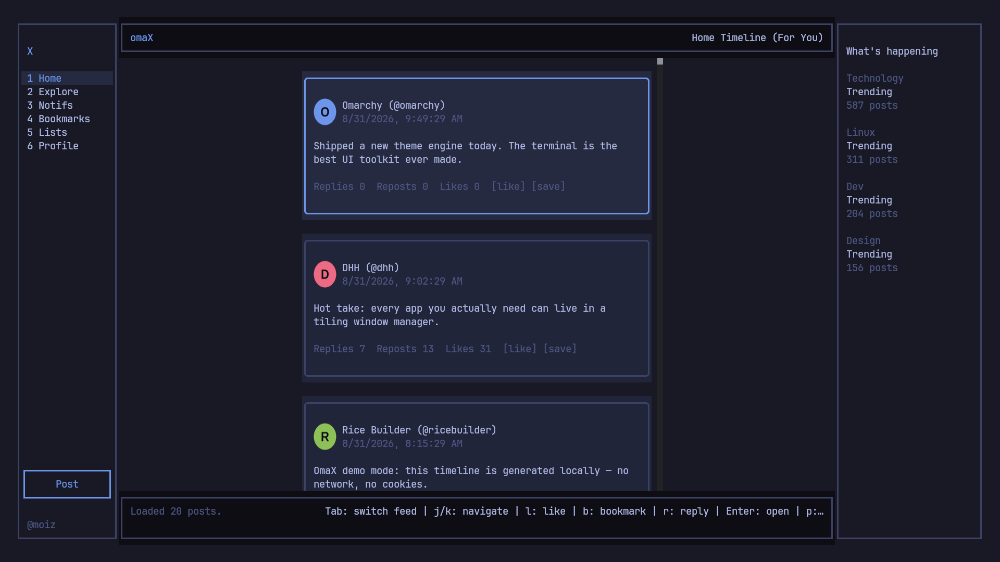
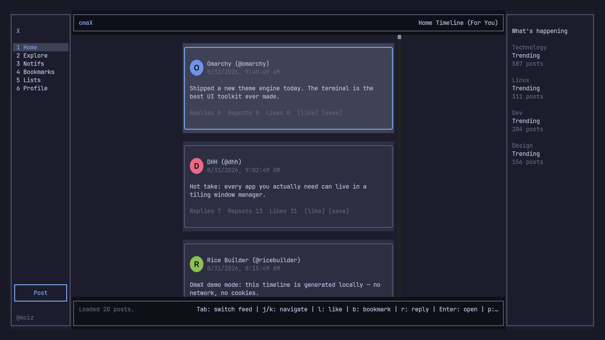
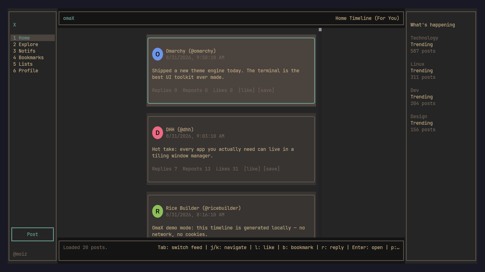
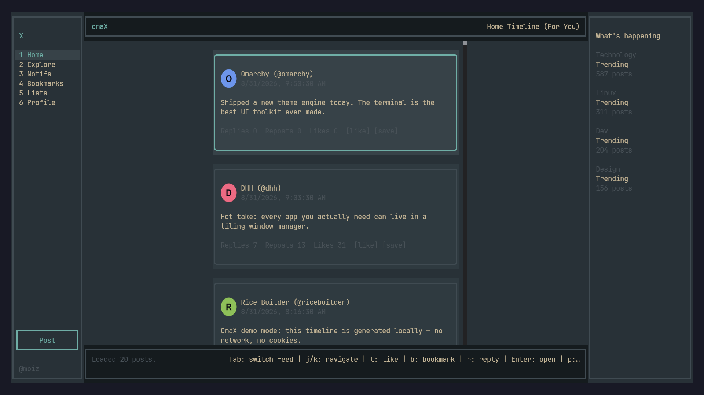

# omaX

**X in the terminal, dressed in your rice.**

omaX is an Omarchy-native client for X (Twitter): a full three-pane TUI —
timeline, explore, notifications, bookmarks, lists, profiles, search, compose —
plus a JSON CLI built for agents. It signs in with the X session already in
your browser, so there are no API keys, no developer account, and no cost per
request.



## It wears your theme

omaX reads the active Omarchy palette at startup and maps it onto every part of
the interface, then watches for theme switches and re-themes itself while it is
running — the same way your terminals do.

| Catppuccin | Gruvbox |
|---|---|
|  |  |

| Everforest | Tokyo Night |
|---|---|
|  |  |

*(Screenshots are `omax demo` — local fixture data, no real account.)*

Point `OMAX_THEME_FILE` at any `colors.toml` to preview a theme without
switching the desktop. With no Omarchy present, a built-in palette applies.

## Install

Requires [Bun](https://bun.sh), `kitty` (for inline avatars and media), plus
`rsync`, `jq` and `libsecret`.

```bash
git clone https://github.com/MoizIbnYousaf/omaX.git
cd omaX
./bin/omax doctor      # prerequisites + the browser sessions it can see
./bin/omax             # pick a profile and go
```

On Omarchy the deployed build also adds an 𝕏 bar launcher (plugin
`greensnow.omax`) that opens omaX in its own kitty window.

## Usage

```bash
omax                    # account picker, then the app
omax --auto             # skip the picker: most recently used session
omax --profile "<name>" # a specific browser profile
omax demo               # offline fixtures — no login, no network
omax cli whoami         # JSON CLI: home, search, read, post, like, ...
omax doctor             # prerequisites and discovered sessions
```

### Keys

`j`/`k` navigate · `Enter` open post · `l` like · `b` bookmark · `r` reply ·
`c` compose · `p` author profile · `/` search · `Tab` For You / Following ·
`1`–`6` sidebar views · `n` load more · `q` back

## Browser sessions

omaX finds the profiles that actually exist on the machine, names them the way
their browser does, and tries the most recently used first:

- **Linux** — Chromium, Chrome, Brave, Edge, Vivaldi, Opera, Thorium and
  Ungoogled Chromium, plus Firefox, LibreWolf, Zen, Floorp and Waterfox, in
  native, Flatpak and Snap layouts.
- **macOS / Windows** — the same families in their platform locations, plus
  Safari on macOS.

Modern Chromium encrypts cookies with a per-build "Safe Storage" key kept in
the login keyring, so each build is unlocked with its own key — Chromium with
Chromium's, Chrome with Chrome's.

```console
$ omax doctor
ok   bun
ok   secret-tool (browser keyring readable)
ok   omarchy theme (~/.local/state/omarchy/current/theme/colors.toml)
ok   Chromium — Personal   [Profile 6]   keyring=yes
ok   Firefox — default-release   [default-release]   keyring=n/a
```

`doctor` reports availability only. omaX never prints, logs, or stores a
cookie or a keyring password; credentials are read in-process on each run.

## For agents

`skills/omax` is an agent skill for reading and — with explicit approval —
posting. Every CLI command prints JSON:

```bash
omax cli home -n 20
omax cli search "omarchy" -n 10
omax cli thread https://x.com/user/status/123
```

Writes (`post`, `reply`, `like`, `follow`) are public and effectively
irreversible, and the skill treats them as a separate authorization class.

## Testing without an account

`./scripts/test` is the release gate: typecheck, unit tests, and an offline
demo smoke test. `./scripts/test --full` adds a 49-assertion TUI suite driven
through tmux against the fixture client — the whole interface exercised with
no cookies and no network.

## Credits

A fork of [`xterminal`](https://github.com/MoizIbnYousaf/xterminal), rebuilt as
an Omarchy product. Built on [OpenTUI](https://github.com/sst/opentui). All
network traffic goes to x.com / twitter.com only. See
[`THIRD_PARTY_NOTICES.md`](THIRD_PARTY_NOTICES.md).

MIT licensed. Not affiliated with X Corp.
